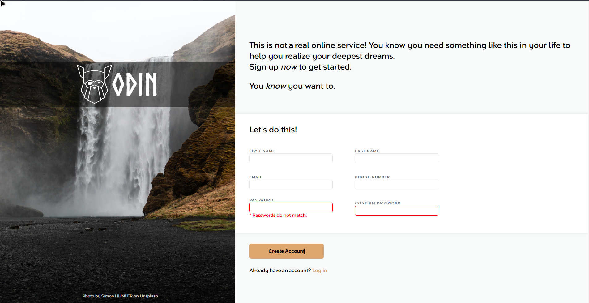

# Odin Project - Sign-up Form

Quick sign-up form with some validation for an imaginary service from the Odin Project curriculum.

## Table of contents

- [Overview](#overview)
  - [Screenshot](#screenshot)
  - [Links](#links)
- [My process](#my-process)
  - [What I learned](#what-i-learned)

## Overview

### Screenshot



### Links

- Live Site URL: [Live Site](https://classy-pixie-21cb53.netlify.app/)

## My Process

- Semantic HTML5 markup
- CSS custom properties
- Flexbox
- CSS Grid
- Vanilla JS

### What I learned

How to validate some part of a form with HTML

```html
<input
	type="text"
	name="first-name"
	id="first-name"
	pattern="[a-zA-Z]+"
	minlength="1"
	maxlength="15"
	required
/>
<input
	type="password"
	name="password"
	id="password"
	pattern="^(?=.*\d)(?=.*[a-z])(?=.*[A-Z])(?!.*\s).*$"
	class="error"
	required
/>
```

How to style element for different state/validation

```css
input:focus {
	border-color: #4a6fd7;
	box-shadow: 5px 5px 15px 0px #e2e3e3;
}

input.error:valid {
	border-color: green;
}
```

How to validate that a password match a confirmation password input

```js
function validatePassword() {
	const password = passwordInput.value;
	const confirmPassword = confirmPasswordInput.value;

	if (password !== confirmPassword) {
		passwordError.style.display = 'block';
	} else {
		passwordError.style.display = 'none';
	}
}

passwordInput.addEventListener('input', validatePassword);
confirmPasswordInput.addEventListener('input', validatePassword);
```
